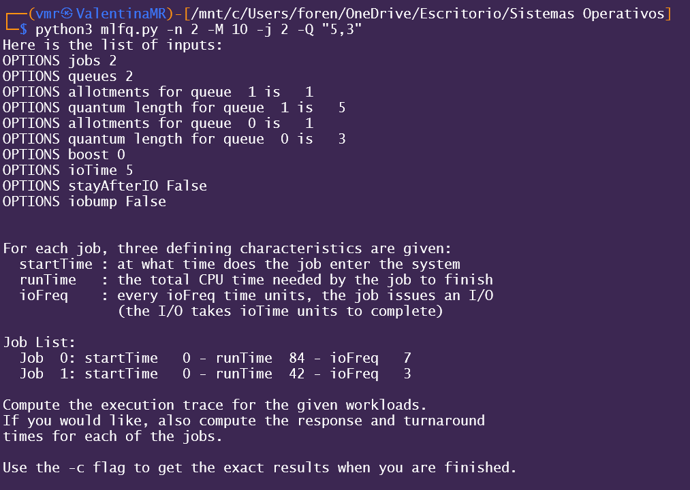
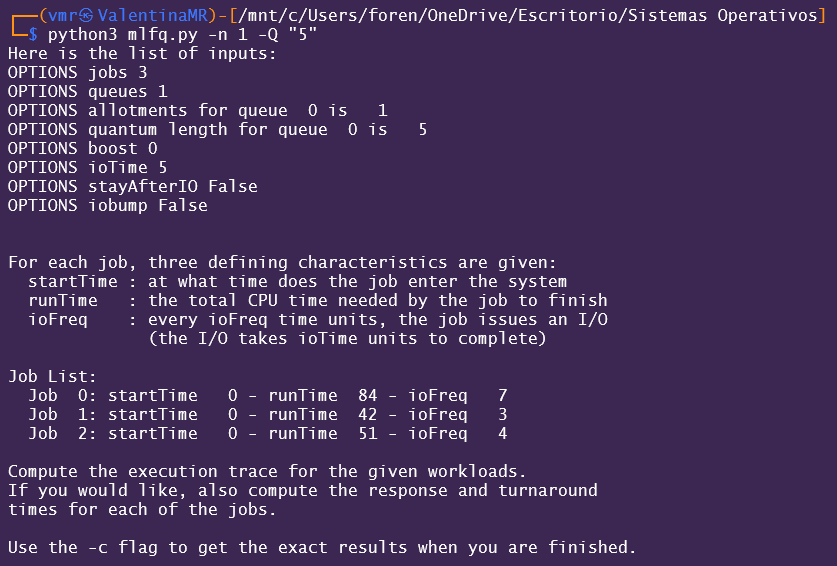
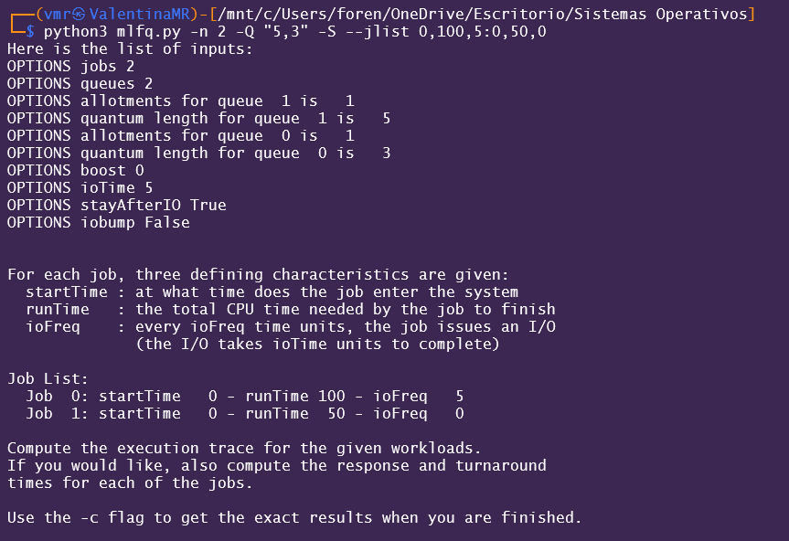
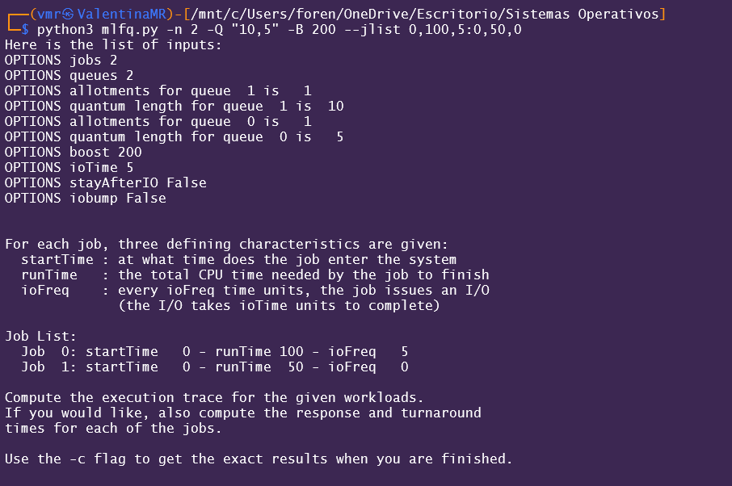
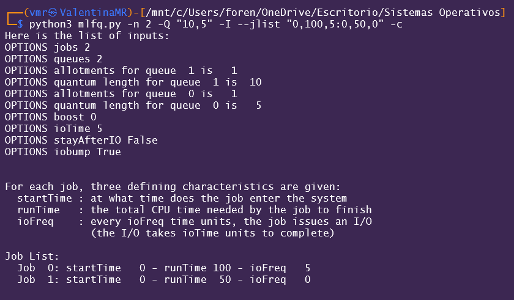

# 😎 Simulación 2 - MLFQ Scheduler Simulation Activity Report

|Who are we?|Contact us|Github|
|---|---|---|
|Valentina Muñoz Rincón 🐜|valentina.munozr1@udea.edu.co|ValenMR|
|Juan Felipe Escobar Rendón 🐔|juan.escobar15@udea.edu.co|juanfes517|

## 🖍 Exercise statement

This program, [mlfq.py](mlfq.py), allows you to see how the MLFQ scheduler presented in this chapter behaves. See the [README](https://github.com/remzi-arpacidusseau/ostep-homework/blob/master/cpu-sched-mlfq/README.md) for details.


#### ➡ Ejecute algunos problemas generados aleatoriamente con solo dos trabajos y dos colas. 
#### ➡ Calcule el seguimiento de ejecución de MLFQ para cada uno. 
#### ➡ Simplifique su trabajo limitando la duración de cada trabajo y desactivando las E/S.


## ❓Questions

#### Ⅰ. ¿Cómo ejecutarías el programador para reproducir cada uno de los ejemplos del capítulo?
   
   <details>
   <summary>
      LOOK AT ME!⬇
   </summary>
      
   Comando ejecutado:
      
   ```bash
   python3 mlfq.py -n 2 -M 10 -j 2 -Q "5,3"
   ```
   - `-n 2`: `2` colas en el MLFQ
   - `-M 10`: tiempo máxima de ejecución en 10 unidades de tiempo
   - `-j 2`: Define dos trabajos
   - `-Q "5,3"`: quantum para las dos colas (la primera con más prioridad de `5` unidades de tiempo y la segunda con menos prioridad de `3` unidades de tiempo)     


   #### Terminal:
   
   

   Ambos trabajos comienzan simultáneamente, pero debido a sus diferentes tiempos de ejecución y frecuencias de I/O, tienen trayectorias de ejecución distintas. El trabajo `0` tardará más tiempo debido a su mayor `runTime`, pero ambos están sujetos a interupciones por I/O y por las colas de prioridad.


   </details>
   <br>

#### Ⅱ. ¿Cómo configurarías los parámetros del programador para que se comporten como un programador round-robin?

   <details>
   <summary>
       LOOK AT ME!⬇   
   </summary>
   
   > **Recordemos algo** : El RR es un algoritmo de planificación de CPU que proporciona un quantum fijo a cada proceso.

   Comando ejecutado:
      
   ```bash
   python3 mlfq.py -n 1 -Q "5"
   ```

   - `-n 1`: Solo una cola, lo que utiliza RR.
   - `-Q "5"`: 5 unidades de tiempo para todos los trabajos.

   #### Terminal:
   
   

   Dado que se configuró con una sola cola el algoritmo se comporta como un Round-Robin. Cada trabajo obtiene 5 unidades de tiempo en orden; si un trabajo no termina en su tiempo (5 unidades), se interrumpe y pasa al final de la cola, así se asgura que cada uno tenga su "turno" para una ejecución más justa y así al final se todos los trabajos se habrán completado. 

   
   </details>
   <br>

#### Ⅲ. Crear una carga de trabajo con dos trabajos y parámetros del programador para que un trabajo aproveche las antiguas Reglas 4a y 4b (activadas con el indicador -S) para manipular el programador y obtener el 99 % de la CPU durante un intervalo de tiempo particular.

   <details>
   <summary>
      LOOK AT ME!⬇
   </summary>

   > **Reglas 4a & 4b** : Estas reglas están relacionadas con la prioridad del trabajo y la ejecución de los trabajos en el MLFQ:
   
   - Regla 4a: cuando existe una operación de I/O, de todas formas el trabajo mantiene su prioridad en la cola donde estaba a menos que esté configurado para cambiar la cola.
   - Regla 4b: si un trabajo termina su allotment pero no ejecuta I/O, su prioridad aumenta o se mantiene igual en la cola de alta prioridad. 

   Comando ejecutado:
      
   ```bash
   python3 mlfq.py -n 2 -Q "5,3" -S --jlist 0,100,5:0,50,0
   ```

   - `-n 2`: Dos colas: una de alta prioridad y otra de baja.
   - `-Q "5,3"`: el quantum para cada cola.
   - `-S`: se activa la regla 4a y 4b para que el trabajo 1 no baje de prioridad cuando realice I/O.
   - `--jlist 0,100,5:0,50,0`: defino los dos trabajos.

   #### Terminal:
   
   

   En este caso, el trabajo 0 utiliza la mayor parte de la CPU gracias a la activación de las reglas 4a y 4b. Por otro lado, el trabajo 1, no realiza I/O pero pasará un tiempo esperando en la cola de baja prioridad y usará menos CPU. 
   
   </details>
   <br>

#### Ⅳ. Dado un sistema con una longitud cuántica de 10 ms en su cola más alta, ¿con qué frecuencia debería aumentar los trabajos al nivel de prioridad más alto (con el indicador `-B`) para garantizar que un solo trabajo de larga duración (y potencialmente hambriento) obtenga al menos el 5 % de la CPU?

   <details>
   <summary>
      LOOK AT ME!⬇
   </summary>

   > **Boosting** : es una herramienta del MLFQ el cual se utiliza para ajustar la prioridad de los trabajos en el sistema de colas. Lo que hace es aumentar la prioridad de los trabajos a intervalor regulares.

   Comando ejecutado:
      
   ```bash
   python3 mlfq.py -n 2 -Q "10,5" -B 200 --jlist 0,100,5:0,50,0
   ```

   - `-B 200`: el boosting ocurre cada 200ms, lo que garantiza que el trabajo de larga duración tenga al menos 10ms de CPU. 

   #### Terminal:
   
   

   En esta parte, se puede observar que el trabajo 0 obtiene el mayor tiempo de CPU ya que hace las I/O frecuentemente y se boostea cada 200 ms, lo que ayuda a ponerlo en la cola de alta prioridad. Por el otro lado, el trabajo 1 no se beneficia del boosting por lo que está en la cola menos prioridad.
      
   </details>
   <br>

#### Ⅴ. Una pregunta que surge en la programación es en qué extremo de la cola se debe agregar un trabajo que acaba de finalizar la E/S. El indicador -I cambia este comportamiento en este simulador de programación. Experimente con algunas cargas de trabajo y vea si puede apreciar el efecto de este indicador.

   <details>
   <summary>
      LOOK AT ME!⬇
   </summary>

   > **Indicador -I** : Este indicador cambia el comportamiento de cómo se maneja el trabajo que ha terminado una operación de I/O. Por defecto, lo que se hace es agregarlo al final de la cola pero si está presente este mecanismo, el trabajo que finaliza I/O se agrega al principio de su cola, dándole prioridad alta. 

   Comando ejecutado:
      
   ```bash
   python3 mlfq.py -n 2 -Q "10,5" -I --jlist "0,100,5:0,50,0"
   ```

   - `-I`: los trabajos que terminan de hace I/O son agregados al principio de su cola, dando prioridad. 

   #### Terminal:
   
   

   Para este escenario, el indicador `-I` influye mucho en la planificación de los trabajos, pues prioriza a los trabajos con I/O frecuente, lo que mejora el rendimiento y rapidez de respuesta. 
   
   </details>
   <br>

## 🎤Conclusions

Esta herramienta ayuda a entender detenidamente cómo funciona la gestión de procesos cuando se ejecuta cualquier programa en un sistema operativo. A lo largo de las pruebas realizadas con los indicadores pertinentes y atributos necesarios se pudo explotar diferentes aspectos que cómo se puede llegar a afectar la ejecución de los trabajos en el sistema.

📥 Se aprendieron varios aspectos como:

- La gestión de las prioridades de los trabajos
- El impacto de los parámetros modificando sus valores
- La interacción con el I/O y dándole prioridad
- Cálculos en el desempeño


### Criterios de evaluación
- [x] Despligue de los resultados y analisis claro de los resultados respecto a lo visto en la teoria.
- [x] Creatividad y orden.
- [x] Sección con las conclusiones de los experimentos realizados.
